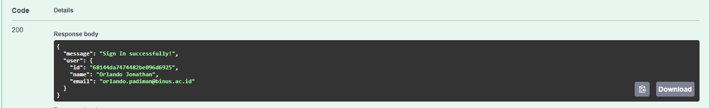

# Todo List MERN Application

A full-stack Todo List application built with the MERN stack (MongoDB, Express.js, React.js, Node.js).

# API Testing Screenshots (Postman)

## Adding a New Todo Item


## Getting All Todo Items


## Updating a Todo Item


## Deleting a Todo Item


# API Testing Screenshots (Swagger)

## User Operations:

### Sign Up:


- The signup field runs a check on whether the input fits the rules required to sign up for an account.
- Upon success, it sends an email to the user for account activation.
- Required fields include: personal_id, name, email, password, confirmPassword, address, and phone_number
- Password must be 6-20 characters with at least one number, one lowercase, and one uppercase letter
- Email must be in a valid format
- Name must be at least 3 characters long

### Account Activation:


- After signing up, users receive an activation email
- Click the activation link to verify your email address
- The activation endpoint requires the activation token from the email
- Once activated, you can proceed to sign in
- If the email is already registered, you'll receive an error message

### Sign In:



- Enter your registered email and password
- Upon successful authentication, you'll receive a JWT token
- The system validates your credentials against the database
- If successful, returns user information (id, name, email)
- If credentials are invalid, returns an error message

## Todo Operations:

### Get All Todos:


- Retrieves all todo items from the database
- Returns an array of todo objects
- Each todo object contains: id, todo_image, todo_name, todo_desc, and todo_status
- Results are sorted by creation date (newest first)
- No authentication required for this endpoint

### Add New Todo:


- Creates a new todo item in the database
- Required fields: todo_image, todo_name, todo_desc, and todo_status
- todo_image should be a valid URL
- todo_status can be "active" or "completed"
- Returns the newly created todo object with its ID
- No authentication required for this endpoint

### Update Todo:


- Updates an existing todo item by its ID
- Can update any combination of fields: todo_image, todo_name, todo_desc, todo_status
- Returns the updated todo object
- If todo ID doesn't exist, returns a 404 error
- No authentication required for this endpoint

### Delete Todo:


- Deletes a todo item by its ID
- Returns a success message if deletion is successful
- If todo ID doesn't exist, returns a 404 error
- No authentication required for this endpoint

## Getting Started

1. Clone the repository
2. Install dependencies:
   ```bash
   npm install
   ```
3. Create a `.env` file in the root directory with the following variables:
   ```
   CONNECTION_URL=your_mongodb_connection_string
   PORT=5000
   EMAIL_USER=your_gmail_address
   EMAIL_PASSWORD=your_gmail_app_password
   DEFAULT_CLIENT_URL=http://localhost:3000
   REFRESH_TOKEN_SECRET=your_refresh_token_secret
   ```
4. Start the server:
   ```bash
   npm start
   ```

## API Documentation

The API documentation is available at `/todolist/api-docs` when the server is running.

### User Endpoints
- `POST /service/user/signup` - Register a new user
- `POST /service/user/activation` - Activate user account
- `POST /service/user/signin` - Sign in user
- `GET /service/user/user-info` - Get user information (requires authentication)

### Todo Endpoints
- `POST /service/todo` - Create a new todo
- `GET /service/todo` - Get all todos
- `PATCH /service/todo/:id` - Update a todo
- `DELETE /service/todo/:id` - Delete a todo

## Features

- User authentication with JWT
- Email verification system
- CRUD operations for todo items
- Input validation
- Secure password hashing
- HTTP-only cookie for token storage
- Swagger API documentation

## Technologies Used

- Node.js
- Express.js
- MongoDB
- Mongoose
- JWT for authentication
- Nodemailer for email service
- Swagger for API documentation
- bcrypt for password hashing 